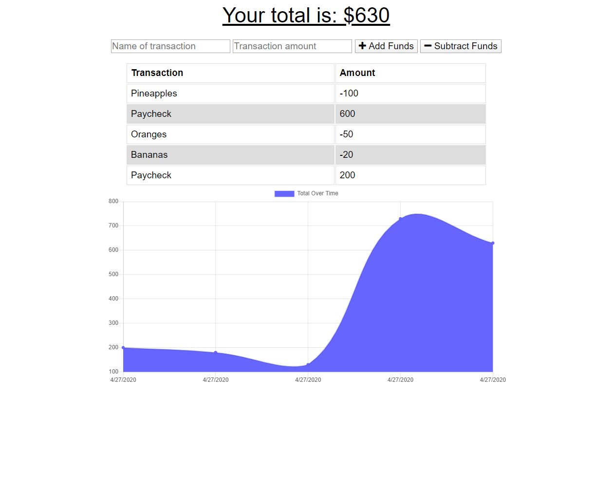

# GT-Homework-15-Online-Offline-Budget-Tracker

A Budget Tracker application that allows for offline access and functionality.

## Description

The user will be able to add expenses and deposits to their budget with or without a connection. When entering transactions offline, they should populate the total when brought back online.

Offline Functionality:

  * Enter deposits offline

  * Enter expenses offline

When brought back online:

  * Offline entries should be added to tracker.

## Table of Contents

* [Installation](#installation)
* [Contributing](#contributing)
* [Website](#website)
* [Repository](#repository)
* [Questions](#questions)
* [License](#license)

## Installation

If you wish to install this application to your device, open the app online at the site url, then in the url search bar click the `+` icon at the right to install the application.

## Contributing

None.

## Website

[Deployed Application](https://stark-sea-84315.herokuapp.com/)

## Repository

[Github Repository](https://github.com/AlanAshworth/GT-Homework-15-Online-Offline-Budget-Tracker)

## Questions

Contact me at <a href="mailto:awashworth927@gmail.com">awashworth927@gmail.com</a>

## License

© 2019 Trilogy Education Services, a 2U, Inc. brand. All Rights Reserved.